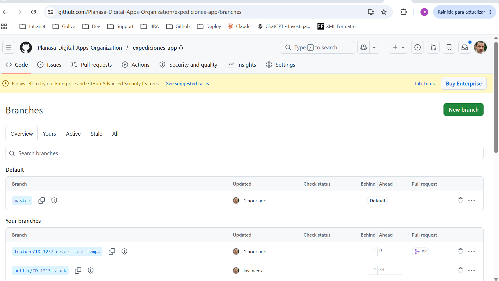
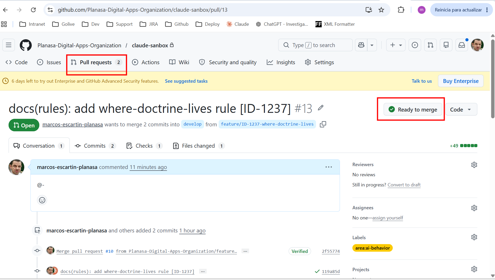
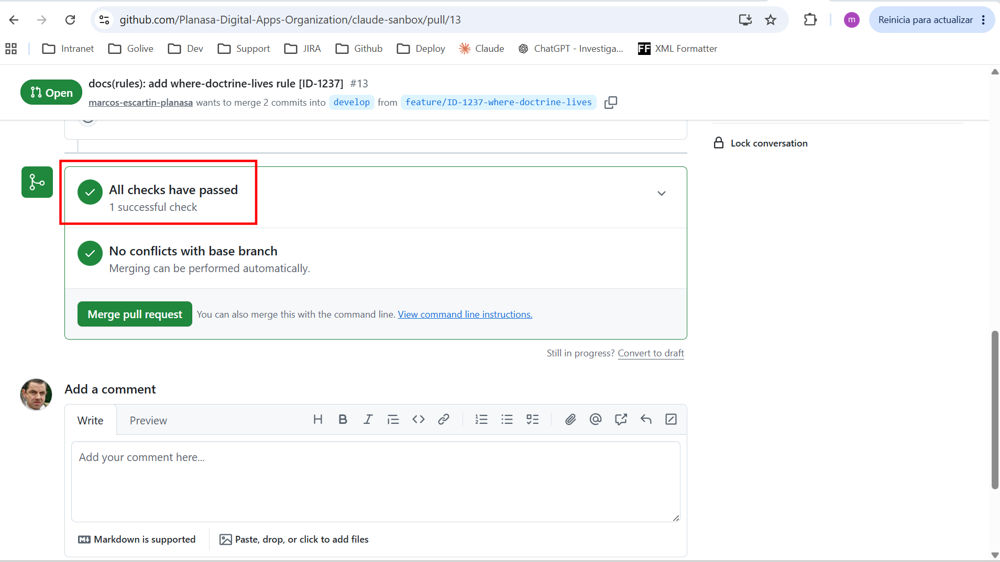

# Tu primera contribución a Planasa Digital Apps

Guía end-to-end de tu primer Pull Request, desde clonar el repo hasta el
merge.

> Esta guía es la versión **accionable**. Para la doctrina detallada (qué
> es Conventional Commits, por qué master-based, qué hace cada ruleset)
> ver el [git-flow runbook](https://github.com/Planasa-Digital-Apps-Organization/claude-sanbox/blob/master/docs/runbooks/git-flow.md)
> y la [commit-style rule](https://github.com/Planasa-Digital-Apps-Organization/claude-sanbox/blob/master/.claude/rules/commit-style.md).

---

## 0. Prerequisitos

- Acceso al org `Planasa-Digital-Apps-Organization`. Si no lo tienes,
  pídeselo al equipo de IT.
- Git configurado con tu email corporativo:

  ```bash
  git config --global user.email "<tu-usuario>@planasa.com"
  git config --global user.name "<Nombre Apellido>"
  ```

- [GitHub CLI (`gh`)](https://cli.github.com/) autenticado:

  ```bash
  gh auth login
  ```

- _(Recomendado)_ [Claude Code](https://claude.com/claude-code) instalado
  con el repo clonado en local. Las skills del template (`commit-flow`,
  `pr-body`, `adr-writer`, etc.) cablean buena parte de los pasos
  siguientes y enforzan la doctrina automáticamente.

## 1. Encontrar el ticket

Toda contribución va asociada a un ticket JIRA. Prefijos válidos:

```
BCR | BTS | ID | MAM | GIT
```

Si tu trabajo no tiene ticket todavía (typo, refactor menor), crea uno
ligero antes de empezar. El sufijo `[<JIRA>-<NNN>]` es obligatorio en
todos los commits y se valida automáticamente.

JIRA del org: <https://planasa.atlassian.net>

## 2. Crear la rama

Toda rama corta nace de `master` actualizado. Naming pattern:

```
feature/<JIRA>-<NNN>-<kebab-slug>
hotfix/<JIRA>-<NNN>-<kebab-slug>
```

Ejemplo:

```bash
git checkout master
git pull
git checkout -b feature/BCR-1234-add-customer-export
```

> 💡 **Tip Claude**: si tienes la skill `commit-flow` cargada, pídeselo en
> lenguaje natural — _"empieza el ticket BCR-1234, va sobre exportar
> clientes a CSV"_. La skill crea la rama con el slug correcto y deja
> todo listo.



## 3. Hacer el cambio

Edita los ficheros necesarios. Algunas convenciones:

- **Tests cerca del cambio**: si tocas `lib/expediciones/service.dart`,
  acompáñalo con cambios en `test/expediciones/service_test.dart`.
- **Path-scoped rules**: si el repo es Flutter, las reglas en
  `.claude/rules/flutter-*.md` se activan automáticamente y validan
  `dart format`, `flutter analyze` antes de cada commit.
- **Hooks**: si el repo tiene `.claude/hooks/post-dart-edit.ps1` o
  similar, corre tras cada `Edit`/`Write` que haga Claude.

> 💡 **Tip Claude**: para diagnosis disciplinada de un bug usa la skill
> `diagnose` (loop reproduce→minimise→fix→regression-test). Para
> decisiones arquitectónicas no obvias, `adr-writer` (formato Nygard).

## 4. Commits

Formato obligatorio:

```
<type>(<scope>): <description> [<JIRA>-<NNN>]
```

`<type>` ∈ `feat | fix | docs | style | refactor | test | chore`.
`<scope>` opcional, single token lowercase.
`<description>` imperativa, ≤ 72 chars, sin punto final.

Stagea explícito (evita `git add .` o `git add -A` para no commitear
secretos por accidente):

```bash
git add lib/expediciones/service.dart test/expediciones/service_test.dart
git commit -m "feat(expediciones): add CSV export endpoint [BCR-1234]"
```

### Buenos vs. malos commits

| ✅ | ❌ |
| --- | --- |
| `feat(api): add customer export endpoint [BCR-1234]` | `Update files` |
| `fix(auth): handle empty token edge case [MAM-42]` | `WIP` |
| `docs(adr): accept 0004 [ID-1237]` | `feat: export` (sin JIRA) |
| `chore(deps): bump intl to 0.20 [BTS-12]` | `feat(api): added export.` (pasado, punto final) |

> 💡 **Tip Claude**: pide _"haz commit"_ con `commit-flow` activo. La
> skill auto-extrae el sufijo `[JIRA-NNN]` del nombre de la rama y
> propone subject según el diff. Tú confirmas o ajustas.

## 5. Push y PR

```bash
git push -u origin feature/BCR-1234-add-customer-export
gh pr create --base develop --web
```

`--web` te abre el editor de GitHub con la plantilla heredada
pre-rellenada.

> 💡 **Tip Claude**: pide _"prepara el PR"_ y la skill `pr-body` genera
> el body siguiendo el template (`## Summary / ## Why / ## Test plan`) a
> partir del diff y commits de la rama.

El cuerpo del PR debe incluir:

- `## Summary` — bullets sobre **qué cambia el comportamiento**, no
  listado de archivos.
- `## Why` — 1-3 frases. Motivo no derivable del diff.
- `## Test plan` — checklist de pruebas locales ya corridas (marca ✅) y
  pruebas que el reviewer debe confirmar (deja `[ ]`).
- `## Notes` _(opcional, obligatorio si tocas paths sensibles)_ —
  cualquier consideración fuera del scope obvio: cambios de permisos,
  decisiones de scope tomadas durante la implementación, follow-ups
  detectados.



## 6. CI y reviews

Tras abrir el PR:

1. **Workflows automáticos** se disparan:
   - `Flag sensitive paths` etiqueta + comenta si tocaste paths
     sensibles (`.claude/**`, `CLAUDE.md`, `AGENTS.md`, `.github/**`,
     `.gitignore`).
   - (Más workflows según el repo: tests, lint, build, security scans.)

2. **CODEOWNERS** notifica automáticamente a los reviewers configurados
   para los paths que tocaste.

3. **Esperá approval**: los reviewers responden con comments o
   approves. Atiende cada comment con un nuevo commit (no `--amend` ni
   force-push, salvo `--force-with-lease` con autorización explícita).



## 7. Merge

Cuando todo está en verde y aprobado:

- **Squash and merge** es el default. Convierte tu rama feature (varios
  commits de iteración) en un único commit limpio en `develop`.
- El commit final usa el subject del PR — verifica que sigue siendo
  Conventional + sufijo JIRA antes de apretar el botón.
- Tras el merge a `develop`, la rama feature se borra automáticamente.
  Si trabajas el siguiente ticket, parte de nuevo desde `master`
  actualizado.


`develop` se mergeará a `master` en bloque cuando llegue el release. No
tienes que orquestar eso tú — los mantenedores se ocupan.

---

## Troubleshooting

### "Cannot create ref due to creations being restricted"

Tu nombre de rama no matchea el patrón del enterprise ruleset.
Renómbrala cumpliendo `^feature/[A-Z0-9]{2,10}-[0-9]{1,4}(-.+)?$`:

```bash
git branch -m feature/BCR-1234-add-customer-export
git push origin --delete <nombre-malo>
git push -u origin feature/BCR-1234-add-customer-export
```

Las ramas auto-generadas por GitHub UI al revertir (`revert-N-...`)
también caen en este caso — usa el patrón `feature/<JIRA>-<NNN>-revert-<topic>`
manualmente en lugar del botón "Revert".

### "Required status check is expected"

Falta que un workflow obligatorio termine. Verifica que `Flag sensitive
paths` y los demás checks hayan corrido (30s-2min típicamente). Si tras
3 min sigue _expected_, abre la pestaña "Actions" del repo a ver si el
workflow está failing o queued.

### "Pull request requires approval"

CODEOWNERS aún no aprobó. Ping al reviewer asignado por su canal menos
intrusivo (Slack/Teams) o pulsa el botón "Re-request review" en GitHub.

### "Branch must be up to date with base branch"

Tu rama está atrasada respecto a `develop`. Actualiza:

```bash
git fetch origin
git rebase origin/develop
git push --force-with-lease
```

> ⚠️ `--force-with-lease` requiere autorización explícita en ramas que
> tengan rulesets de _restrict updates_. Si choca, mejor abrir un PR
> nuevo desde una rama nueva.

### Conventional commit lint falla

El título del PR o el subject del commit no matchea el formato. Edita
con `gh pr edit <NN> --title "<correcto>"`. Si el subject del commit es
el problema y el PR sigue abierto, haz un commit nuevo arreglando — no
uses `--amend` para PRs ya pusheadas (chafa la historia que reviewers
puedan estar mirando).

### El PR no se etiqueta con `area:ai-behavior` y creo que debería

El workflow `Flag sensitive paths` se dispara sólo si los paths
cambiados matchean el filtro. Verifica con `gh pr view <NN> --json
files` que tu diff incluye al menos uno de `.claude/**`, `CLAUDE.md`,
`AGENTS.md`, `.github/**` o `.gitignore`. Si sí, comprueba en la pestaña
Actions que el workflow corrió.

---

## TODO — screenshot pendiente

| Fichero | Qué capturar |
| --- | --- |
| `images/04-squash-merge.png` | Dropdown del botón "Merge" abierto, con "Squash and merge" seleccionado. |
